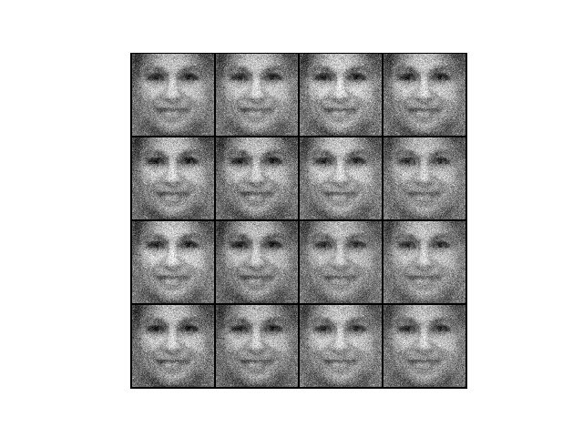

# Faces-GAN

Attempt at creating GAN for generating artificial faces using PyTorch.

Uses cropped faces dataset found [here](https://susanqq.github.io/UTKFace/).

## Epoch 0

### Batch 0

The generator initially creates random static with no discernible patterns.

### Batch 200

By the 200th batch the static has already been transformed into a recognizable human face.
Each face still looks near identical at this point and are androgynous in appearance.

### Batch 3900

By the end of the first epoch you can actually start to discern traits such as gender, race and age group. The faces are still fairly "ghostly" in appearance and lack some fine detail.

## Epoch 3

By the third epoch facial features such as eyebrows have started to become slightly more distinct and interestingly there seems to be a greater variety of facial expressions on show, with some faces showing varying states of happiness while others remain more neutral.

## Epoch 8

At epoch 8 you can see some of the images blurriness, particularly at the edges of generated images, has started to become more subtle. Features such as facial hair are more defined and the contours of the face seem more detailed.

# TODO

## Face Seed

I'm keen to try using a human face as an input for the generator, in place of the static which is the current random seed. Theoretically, this should transform the given face into a new one which is still based on the original subject. Effectively "normalizing" them.
